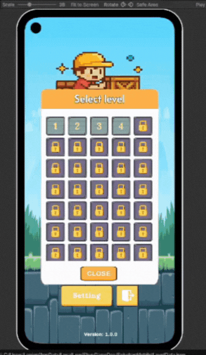
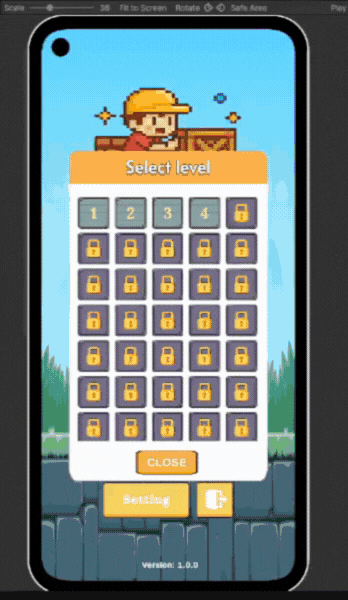
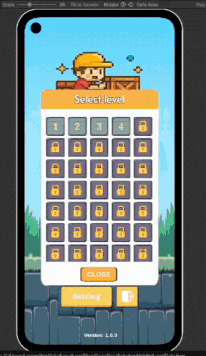
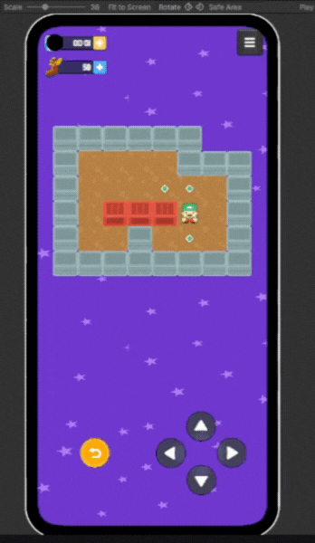
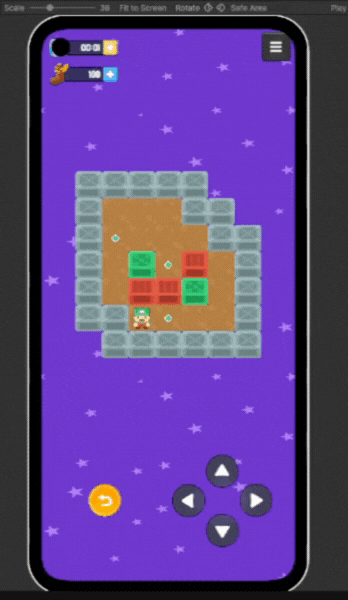
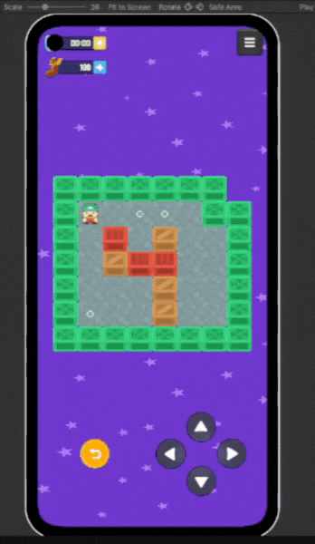
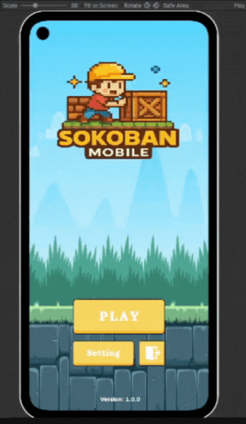
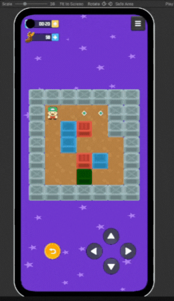

# 🎮 Sokoban2D

🚀 Sokoban Puzzle Game là một dự án game giải đố 2D cổ điển được phát triển bằng Unity, lấy cảm hứng từ trò chơi Sokoban huyền thoại xuất hiện từ những năm 1980.
Trong game, người chơi vào vai một nhân vật di chuyển trong mê cung gồm các khối tường, hộp, và các điểm đánh dấu (checkpoint). Nhiệm vụ chính là đẩy tất cả các hộp vào đúng vị trí checkpoint với số bước đi ít nhất có thể — không có cơ chế kéo, chỉ được đẩy và không thể đi xuyên tường hoặc đẩy nhiều hộp cùng lúc. 

🚀 Game tập trung vào yếu tố logic, tính toán đường đi hiệu quả và sử dụng chiến lược để giải từng màn chơi. Mỗi cấp độ đều mang tính thử thách riêng: từ dễ nắm bắt ở cấp độ đầu đến các câu đố phức tạp đòi hỏi người chơi phải thử nghiệm, sai và hoàn tác nhiều lần trước khi tìm ra giải pháp đúng. 

---
## 📖 Mô Tả

- **Thể loại**: 2D, puzzle, Mobile
- **Công cụ**: Unity (phiên bản 2022.3.58f1), Visual Studio 2022, Adobe Photoshop  
- **Mục tiêu**: Hoàn thành trò chơi đầy đủ các tính năng chính như giao diện trang chủ, chọn màn chơi, tải và lưu dữ liệu theo từng màn, reload, pause, ... Tối ưu hệ thống gameplay mượt mà, mâng lại trải nghiệm tốt cho người chơi. Phục vụ cho việc làm dự án cá nhân để giới thiệu kĩ năng của bản thân cũng nhữ các định hướng khác trong tương lai. 

---
## 🔧 Tính năng:

- ✔️ Hệ thống điều khiển đơn giản, phù hợp với nhiều đối tượng. 
  
- ✔️ Undo nhiều bước (cả vị trí người chơi và hộp) để hỗ trợ trải nghiệm thử–sai hiệu quả. 

- ✔️ Thiết kế modular và mở rộng dễ dàng thêm nhiều màn chơi mới chỉ bằng cách cập nhật file JSON dữ liệu màn chơi. 

- ✔️ Đổi màu hộp theo trạng thái (đúng/không đúng vị trí), giúp phản hồi trực quan hơn cho người chơi. 

- ✔️ Hệ thống âm thanh tách rời bằng ScriptableObject, dễ mở rộng và kiểm soát cho từng hành động trong game. 

- ✔️ Đồng bộ hóa dữ liệu giữa lần chơi đầu tiên và sau khi build game, đảm bảo file JSON được tự động sao chép từ thư mục StreamingAssets sang persistentDataPath. 

- ✔️ Thiết kế mã nguồn theo nguyên tắc solid

---

## 📸 Demo

  
  
  
  
  
   
  
  
  
  

  
  
  <i>Sample results</i>

